# RLClock App
A cross-platform app to interact with the RLClock website, with native settings and time tracking

## Features
- [x] Time Tracking
- [x] Custom Classes
- [x] Check schedule for other days
- [x] Lunch Customization (disabled during remote learning)
- [x] Dark Mode
- [] Notifications
# Screenshots
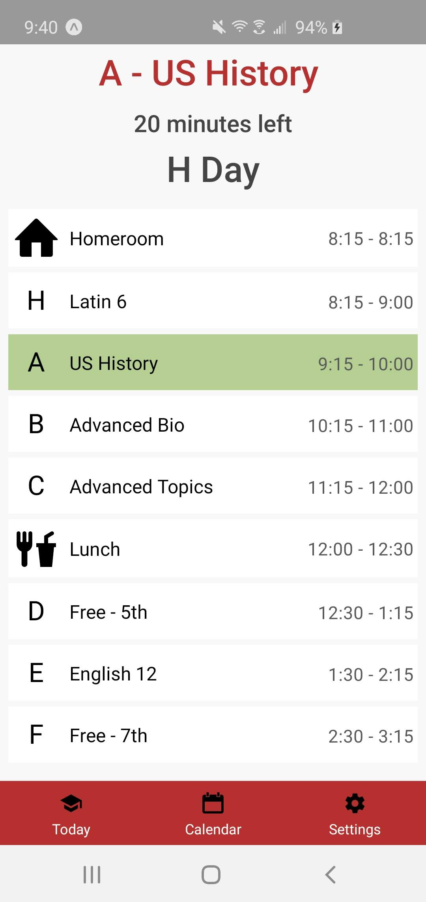

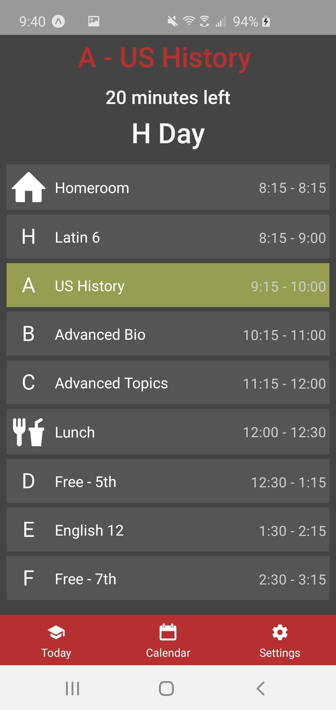

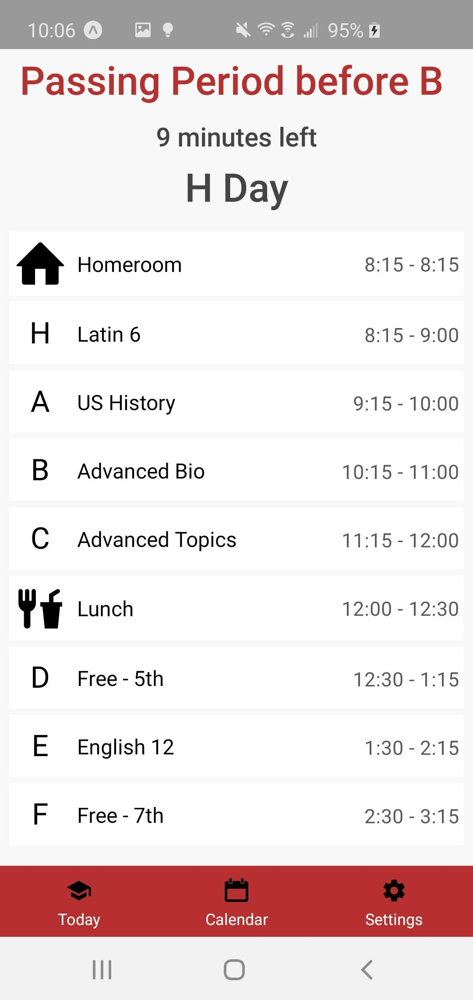

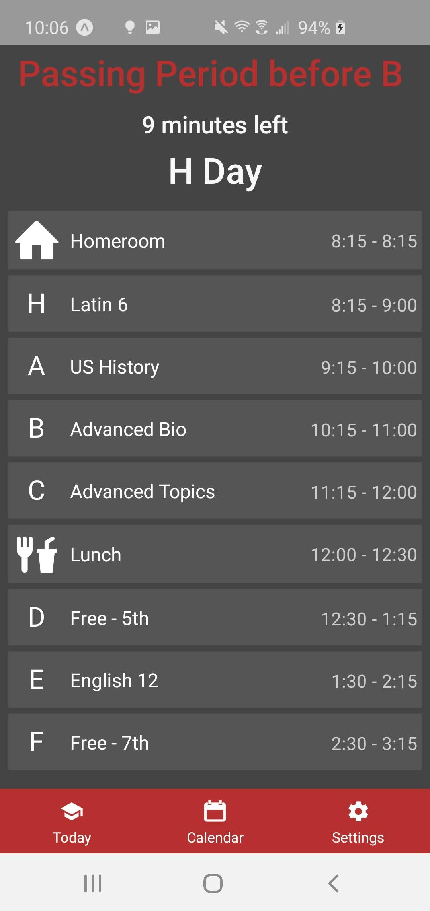

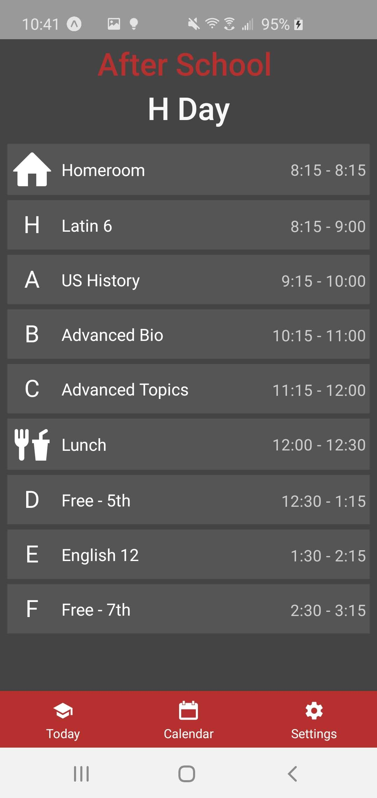

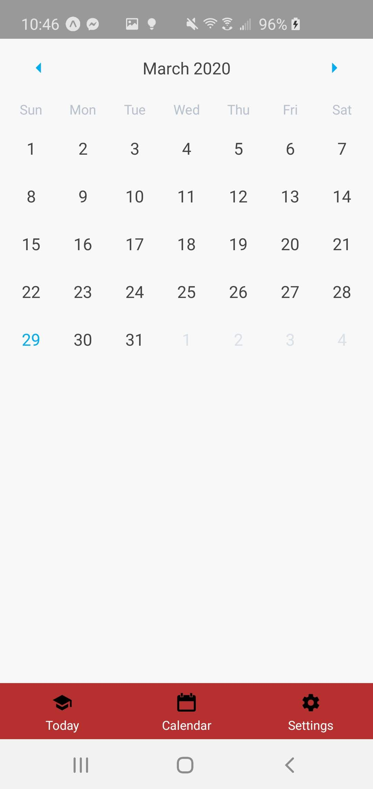

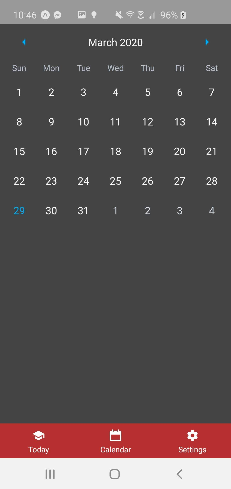

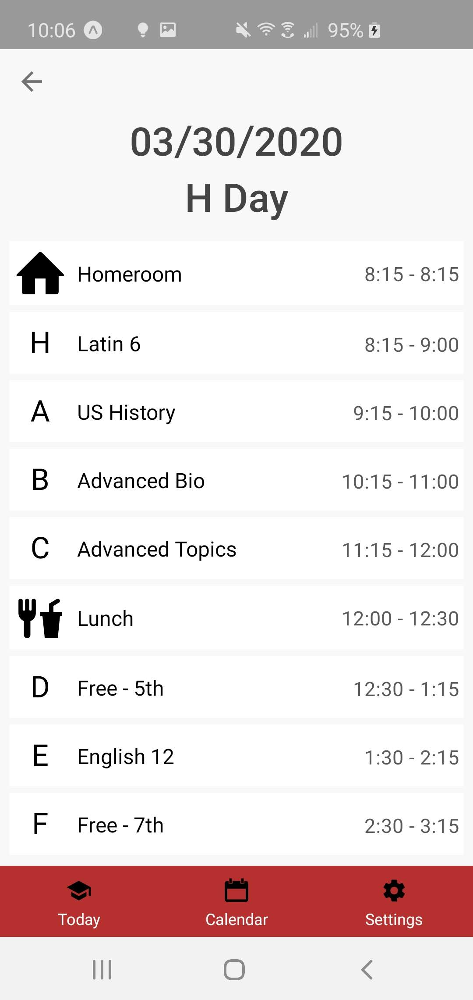

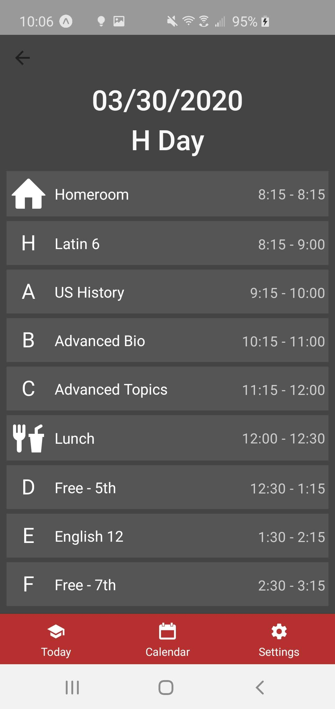

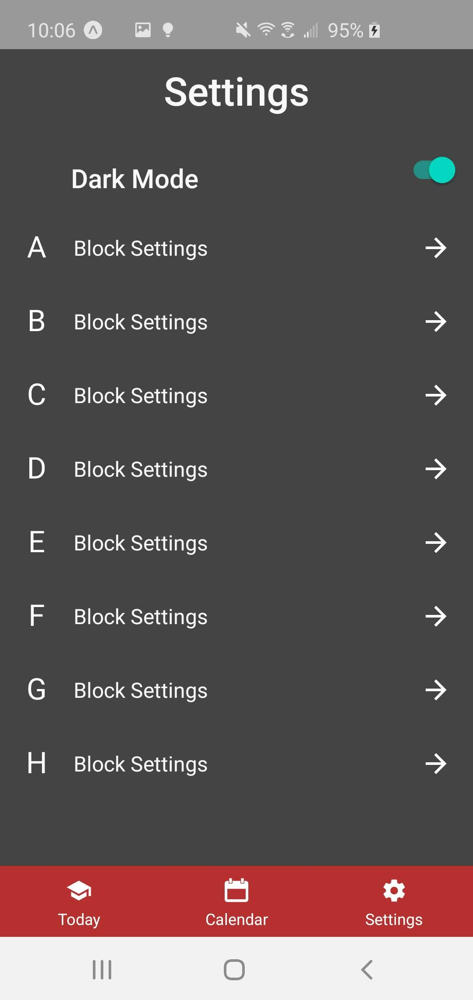

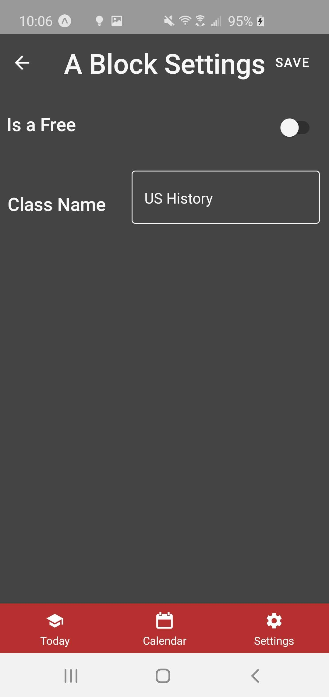
